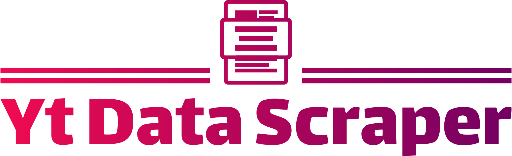

<!-- Improved compatibility of back to top link: See: https://github.com/othneildrew/Best-README-Template/pull/73 -->

<a name="readme-top"></a>

<!--
*** Thanks for checking out the Best-README-Template. If you have a suggestion
*** that would make this better, please fork the repo and create a pull request
*** or simply open an issue with the tag "enhancement".
*** Don't forget to give the project a star!
*** Thanks again! Now go create something AMAZING! :D
-->

<!-- PROJECT SHIELDS -->
<!--
*** I'm using markdown "reference style" links for readability.
*** Reference links are enclosed in brackets [ ] instead of parentheses ( ).
*** See the bottom of this document for the declaration of the reference variables
*** for contributors-url, forks-url, etc. This is an optional, concise syntax you may use.
*** https://www.markdownguide.org/basic-syntax/#reference-style-links
-->

<!-- PROJECT LOGO -->
<br />
<div align="center">
  <a href="https://ytdatascraper.vercel.app">
    
  </a>

  <h3 align="center">Yt Data Scraper</h3>

  <p align="center">
    Extract Data From Any YouTube Video, quickly and easily!
    <br />
    <a href="https://ytdatascraper.vercel.app"><strong>Check the website »</strong></a>
    <br />
    <br />
  </p>
</div>

<!-- TABLE OF CONTENTS -->
<details>
  <summary>Table of Contents</summary>
  <ul>
    <li>
      <a href="#about-the-project">About The Project</a>
      <ul>
        <li><a href="#built-with">Built With</a></li>
      </ul>
    </li>
    <li>
      <a href="#getting-started">Getting Started</a>
      <ul>
        <li><a href="#prerequisites">Prerequisites</a></li>
        <li><a href="#installation">Installation</a></li>
      </ul>
    </li>
    <li><a href="#usage">Usage</a></li>
  </ul>
</details>

<!-- ABOUT THE PROJECT -->

## About The Project


<br />
<br />

### Built With

- [![Next][Next.js]][Next-url]
- [![TailwindCSS][TailwindCSS]][Tailwind-url]
- [![Node][Node.js]][Node-url]
- [![Vercel][Vercel]][Vercel-url]

<!-- GETTING STARTED -->

## Getting Started

This is an example of how you may give instructions on setting up your project locally.
To get a local copy up and running follow these simple example steps.

### Prerequisites

This is an example of how to list things you need to use the software and how to install them.

- npm
  ```sh
  npm install npm@latest -g
  ```

### Installation

_Below is an example of how you can instruct your audience on installing and setting up your app. This template doesn't rely on any external dependencies or services._

1. Clone the repo
   ```sh
   git clone https://github.com/VhalennnG/AI_Chat_Generator.git
   ```
2. Install NPM packages
   ```sh
   npm install
   ```

<!-- USAGE EXAMPLES -->

## Usage

Use this tool to extract comprehensive data from YouTube videos, including transcripts, descriptions, titles, likes, and duration. Whether you're gathering data for research, content analysis, or building a dataset for machine learning, this tool provides an efficient way to collect and organize YouTube video information. By automating the data extraction process, it saves time and enhances productivity, enabling you to focus on analyzing and utilizing the data effectively.

<!-- CONTACT -->

## Contact

Vhalen_G - [vhalentinog@gmail.com](mailto:vhalentinog@gmail.com)

Project Link: [AI Chat Generator](https://github.com/VhalennnG/youtube-datascraper)

<!-- MARKDOWN LINKS & IMAGES -->
<!-- https://www.markdownguide.org/basic-syntax/#reference-style-links -->

[product-screenshot]: images/Screenshot.png
[Node.js]: https://img.shields.io/badge/node.js-339933?style=for-the-badge&logo=nodedotjs&logoColor=white
[Node-url]: https://nodejs.org/en
[Vercel]: https://img.shields.io/badge/vercel-000000?style=for-the-badge&logo=vercel&logoColor=white
[Vercel-url]: https://vercel.com/
[Next.js]: https://img.shields.io/badge/next.js-000000?style=for-the-badge&logo=nextdotjs&logoColor=white
[Next-url]: https://nextjs.org/
[TailwindCSS]: https://img.shields.io/badge/tailwindcss-38B2AC?style=for-the-badge&logo=tailwindcss&logoColor=white
[Tailwind-url]: https://tailwindcss.com/

